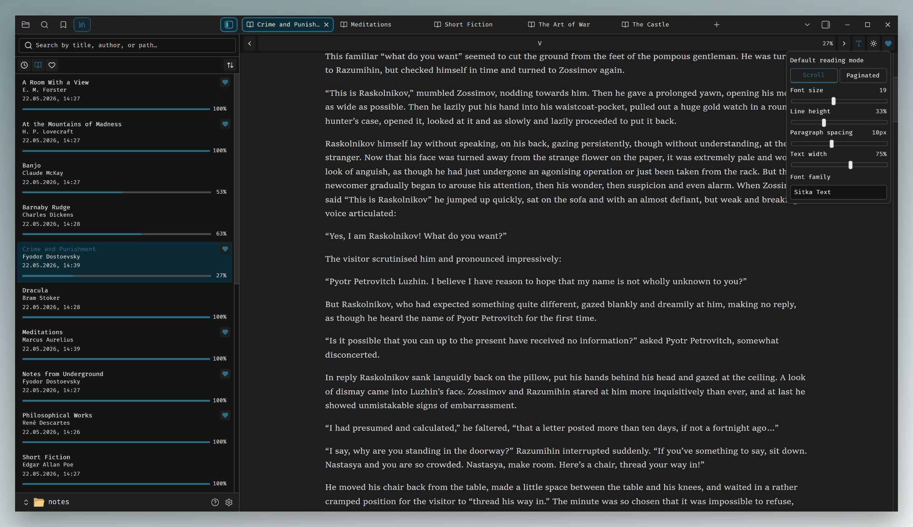

<h1 align="center">4now Reader</h1>

<p align="center">An Obsidian plugin that opens EPUB books from your vault in a dedicated reader pane.</p>

<p align="center">
  
</p>

---

A personal side project. I spend most of my day in Obsidian and wanted to read books in the same window without juggling a separate ebook app. The plugins I tried didn't fit what I needed, so I wrote my own. Got through a couple of books with it, and that's where my motivation to keep developing it ended. The repository is here as a record of the work.

Not published to the Obsidian community catalog and isn't planned to be. Desktop only.

## Stack

TypeScript, React 19, epubjs, esbuild. Bilingual EN/RU UI.

## Reader

Continuous-scroll and paginated modes. Six themes including an `adaptive` one that follows Obsidian. Typography (font family, size, line height, paragraph spacing, text width) is injected into the EPUB iframe with per-book overrides via a popover. Reading position is persisted per book as an EPUB CFI.

## Library

Recent / All / Favorites tabs with title/author/path search and sort. Recent is ordered by last-navigation time - the book at the top is the one you were actually reading, regardless of which leaf Obsidian happened to restore last. `data.json` is schema-versioned with hand-rolled migrations that clamp values to bounds and drop unknowns.

## What was planned but isn't here

Scaffolding only, no UI:

- Bookmarks and highlights
- Export of annotations to Markdown
- Additional formats (PDF, FB2, MOBI, AZW3) via a pluggable renderer
- Mobile support
- Cover thumbnails

## Build

```bash
pnpm install
pnpm build
```

Copy `main.js`, `manifest.json`, `styles.css` into `<vault>/.obsidian/plugins/4now-reader/` and enable the plugin. For iteration against a real vault: `OBSIDIAN_PLUGIN_DIR=... pnpm dev`.
